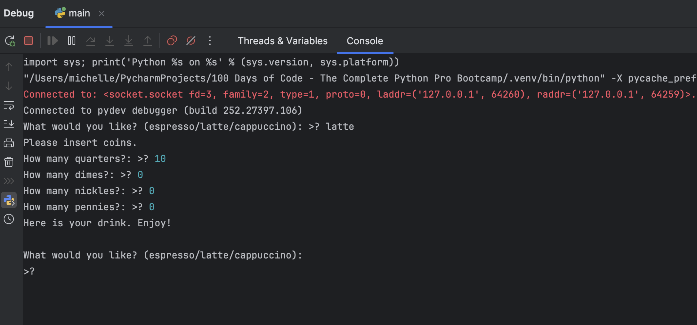

# Virtual Coffee Machine (Python)

This project simulates a **coffee machine** that can serve **espresso, latte, and cappuccino**.  
It demonstrates control flow, user input handling, and resource management.

---

## Features

- Check available resources (water, milk, coffee, money)
- Make drinks based on user input
- Process coins and provide change
- Track resources and money in real time
- Generate a report of current resources

---

## Technical Concepts

- Python programming fundamentals
- Loops and conditionals
- Functions and modular code
- User input handling
- Basic transaction logic (coin processing)
- State management (resources, money)

---

## Output Preview



---

## How to Run the Coffee Machine

1. Ensure **Python 3** is installed.

2. Clone the repository:
```bash
git clone https://github.com/MichelleRunning/virtual-coffee-machine.git
cd virtual-coffee-machine
```

3. Run the program:
```bash
python main.py
```

4. Follow on-screen instructions:
- Type espresso, latte, or cappuccino to make a drink
- Type report to see current resources
- Type off to turn off the machine
